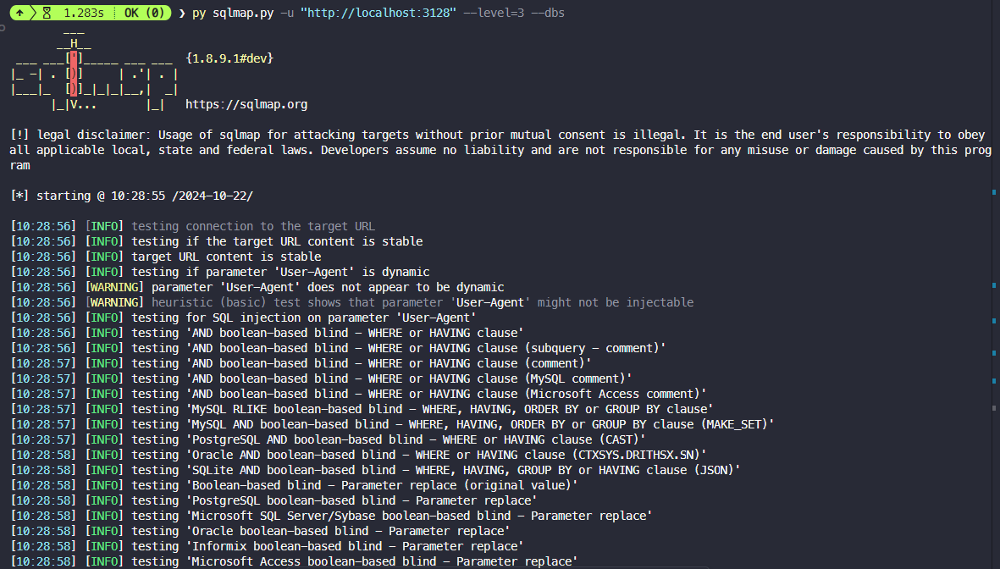

# Task 2: Attack on the database of Vulnerable App from SQLi lab 
- Start docker container from SQLi. 

Run docker container from SQLi:
```sh
docker compose up -d
```


Website running on port 3128.


- Install sqlmap.
To get into the Linux command line of the Docker container and install sqlmap, you can follow these steps:

1. First, identify the container name or ID. From the Docker Compose file, we can see that the web container is named `www-10.9.0.5`. You can verify this by running:

```bash
docker ps
```


2. To enter the container's command line, use:

```bash
docker exec -it www-10.9.0.5 /bin/bash
```

3. Once inside the container, you'll need to update the package lists and install sqlmap. However, the container might be running a minimal image that doesn't include package managers. If that's the case, you'll need to install them first. Here are the steps:

```bash
# Update package lists
apt-get update

# Install Python and pip (if not already installed)
apt-get install -y python3 python3-pip

# Install sqlmap using pip
pip3 install sqlmap
```

Another way to install sqlmap in terminal:
```sh
pip install sqlmap
```

4. After installation, you can verify sqlmap is installed by running:

```bash
sqlmap --version
```


- Write instructions and screenshots in the answer sections. Strictly follow the below structure for your writeup. 

**Question 1**: Use sqlmap to get information about all available databases
**Answer 1**:

Use script into terminal:
```sh
py sqlmap.py -u "http://localhost:3128" --level=3 --dbs
```



Detect database is MySQL.


Detect 79 tables.


Detailed explanation:
- `py sqlmap.py`: This runs the sqlmap Python script.
- `-u "http://localhost:3128"`: Specifies the target URL to test for SQL injection vulnerabilities.
- `--level=3`: Sets the level of tests to perform. Level 3 is more thorough than the default and includes more payload tests.
- `--dbs`: Instructs sqlmap to enumerate and retrieve the names of all available databases on the target system.

This command attempts to exploit SQL injection vulnerabilities in the target URL to discover all databases accessible to the application. The higher level (3) increases the chances of finding vulnerabilities but may also increase the time taken and the load on the target server.

**Question 2**: Use sqlmap to get tables, users information
**Answer 2**:

Use script into terminal:
```sh
py sqlmap.py -u "http://localhost:3128/unsafe_home.php?username=Admin'--&Password=" --level=5 --risk=3 --tables --users --dump
```


Detailed explanation:
- `-u "http://localhost:3128/unsafe_home.php?username=Admin'--&Password="`: Specifies the target URL, including a potential injection point in the username parameter.
- `--level=5`: Sets the highest level of tests, which includes all possible injection techniques and locations.
- `--risk=3`: Sets the highest risk level, allowing sqlmap to use potentially dangerous payloads that might affect database integrity.
- `--tables`: Instructs sqlmap to enumerate all tables in the discovered databases.
- `--users`: Tells sqlmap to retrieve information about database users.
- `--dump`: Attempts to dump the contents of all discovered tables.

This comprehensive command attempts to exploit the SQL injection vulnerability to extract as much information as possible, including table structures, user details, and table contents. The high level and risk settings make this a very aggressive scan, which could potentially cause issues with the target database if not used carefully.


Database users tables store in `C:\AnhTuDev\Uni\IS\lab-is\submission\lab_1_02FIE\task_2\code\sqlmap-dev\data\txt\common-columns.txt`

**Question 3**: Make use of John the Ripper to disclose the password of all database users from the above exploit
**Answer 3**:

Use script into terminal:
```sh
py sqlmap.py -u "http://localhost:3128/unsafe_home.php?username=Admin'--&Password=" --dump -D sqllab_users -T credential --batch --output-dir=./sqlmap_output
```

Check output in `sqlmap_output` folder.


Check table `credential` in `sqllab_users` database.


You can see the password of all database users in `sqlmap_output` folder or `credential` table.

Detailed explanation:
- `-u "http://localhost:3128/unsafe_home.php?username=Admin'--&Password="`: Specifies the target URL with a potential injection point.
- `--dump`: Instructs sqlmap to retrieve and output the contents of the specified table.
- `-D sqllab_users`: Specifies the target database name.
- `-T credential`: Specifies the target table name within the database.
- `--batch`: Runs sqlmap in non-interactive mode, automatically choosing default actions without user input.
- `--output-dir=./sqlmap_output`: Directs sqlmap to save all output files in the specified directory.

This command focuses on extracting the contents of the 'credential' table from the 'sqllab_users' database, which likely contains user login information. The `--batch` option automates the process, and the output is saved to a specific directory for easy access.

While the question mentions John the Ripper, the sqlmap command doesn't directly use it. To use John the Ripper with the extracted passwords:

1. Extract the password hashes from the sqlmap output.
2. Save these hashes in a file (e.g., `hashes.txt`).
3. Run John the Ripper on this file:

```bash
john hashes.txt
```

John the Ripper will attempt to crack the password hashes using various techniques and wordlists. The cracked passwords can then be viewed using:

```bash
john --show hashes.txt
```

This process allows you to potentially reveal the plaintext passwords of database users, demonstrating the importance of using strong, unique passwords and properly securing sensitive information.

**Conclusion**:

- Use sqlmap to get information about all available databases.
- Use sqlmap to get tables, users information.
- Make use of John the Ripper to disclose the password of all database users from the above exploit.
