# Task 1: Public-key based authentication 
**Question 1**: 
Implement public-key based authentication step-by-step with openssl according the following scheme.


**Answer 1**:

## 1. Set up the environment with Docker

Prerequisite: Dockerfile

```dockerfile
FROM ubuntu:20.04

# Install required packages
RUN apt-get update && apt-get install -y \
    openssl \
    netcat-traditional \
    vim \
    && rm -rf /var/lib/apt/lists/*

WORKDIR /crypto
```

Prerequisite: docker-compose.yml

```yml
version: '3'
services:
  server:
    build: .
    hostname: server
    image: server
    networks:
      - crypto_net
    volumes:
      - ./server:/crypto/server
    command: tail -f /dev/null
    container_name: server

  client:
    build: .
    hostname: client
    image: client
    networks:
      - crypto_net
    volumes:
      - ./client:/crypto/client
    command: tail -f /dev/null
    container_name: client

networks:
  crypto_net:
    driver: bridge
```
__Explanation Details__
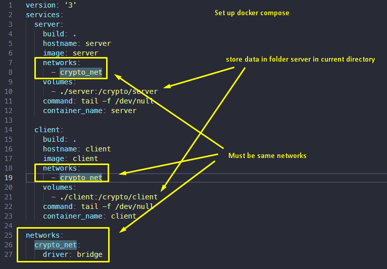

Build the docker image:

```bash
docker compose up -d
```

If you want to rebuild the docker image and update the container, you can run:

```bash
docker compose down
docker compose build
docker compose up -d
```

## 1. Key Generation Phase

**Server Side:**
```bash
# Generate 2048-bit RSA private key
openssl genrsa -out /crypto/server/private.pem 2048

# Extract public key from private key
openssl rsa -in /crypto/server/private.pem -pubout -out /crypto/server/public.pem
```
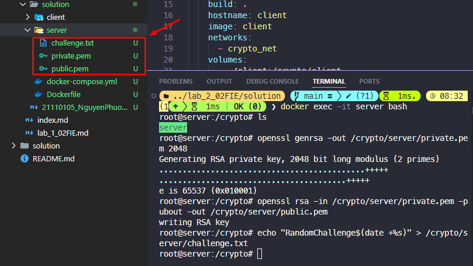

**Client Side:**
```bash
# Generate 2048-bit RSA private key
openssl genrsa -out /crypto/client/private.pem 2048

# Extract public key from private key
openssl rsa -in /crypto/client/private.pem -pubout -out /crypto/client/public.pem
```
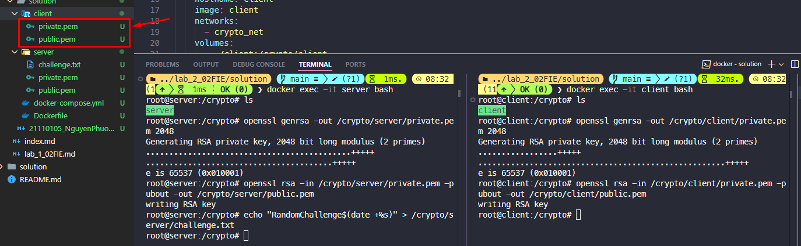

**Explanation:**
- Both server and client generate their RSA key pairs
- Private keys are 2048 bits for strong security
- Public keys are extracted from private keys using `-pubout` option

## 2. Challenge Creation Phase

**Server Side:**
```bash
# Create random challenge with timestamp
echo "RandomChallenge$(date +%s)" > /crypto/server/challenge.txt

# Listen for client's public key
echo "Waiting for client's public key..."
nc -l -p 1234 > /crypto/server/client_public.pem
```
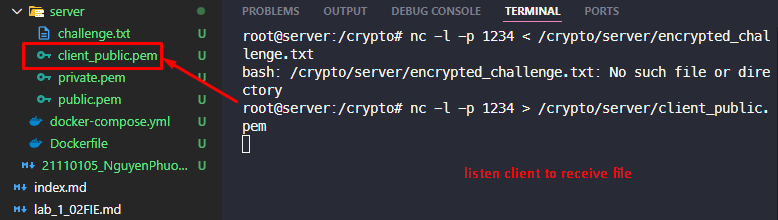


**Client Side:**
```bash
# Send public key to server
echo "Sending public key to server..."
nc server 1234 < /crypto/client/public.pem
```


**Explanation:**
- Server creates unique challenge using current timestamp
- Server listens on port 1234 for client's public key
- Client sends its public key to server using netcat

## 3. Challenge Encryption Phase

**Server Side:**
```bash
# Encrypt challenge using client's public key
openssl rsautl -encrypt \
    -pubin \
    -inkey /crypto/server/client_public.pem \
    -in /crypto/server/challenge.txt \
    -out /crypto/server/encrypted_challenge.txt

# Send encrypted challenge
echo "Sending encrypted challenge..."
nc -l -p 1234 < /crypto/server/encrypted_challenge.txt
```
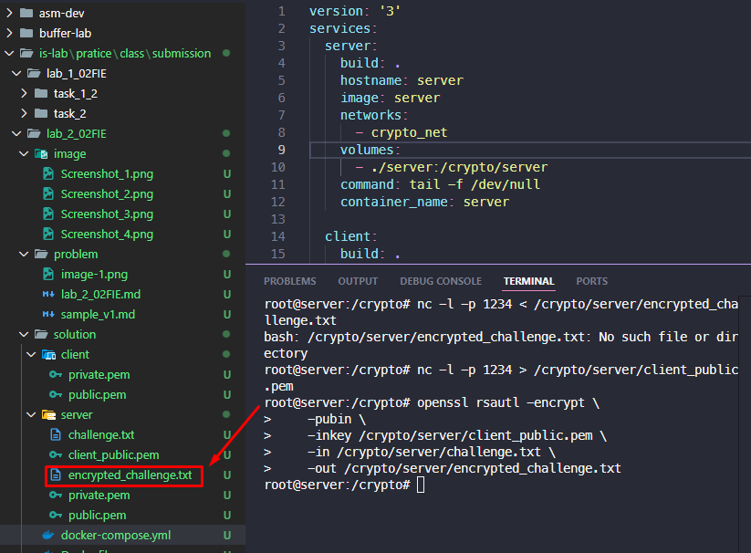

**Client Side:**
```bash
# Receive encrypted challenge
echo "Receiving encrypted challenge..."
nc server 1234 > /crypto/client/encrypted_challenge.txt
```
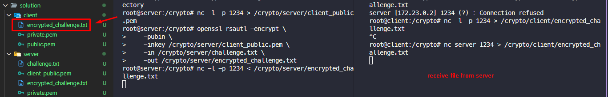
**Explanation:**
- Server encrypts challenge with client's public key
- Only client can decrypt it with their private key
- Encrypted challenge is sent via netcat

## 4. Challenge Decryption Phase

**Client Side:**
```bash
# Decrypt challenge using private key
openssl rsautl -decrypt \
    -inkey /crypto/client/private.pem \
    -in /crypto/client/encrypted_challenge.txt \
    -out /crypto/client/decrypted_challenge.txt
```
**Explanation:**
- Client uses their private key to decrypt challenge
- This proves client possesses the correct private key

## 5. Challenge Signing Phase

**Client Side:**
```bash
# Sign decrypted challenge with private key
openssl dgst -sha256 \
    -sign /crypto/client/private.pem \
    -out /crypto/client/signature.txt \
    /crypto/client/decrypted_challenge.txt

# Send signature to server
echo "Sending signature..."
nc server 1234 < /crypto/client/signature.txt
```
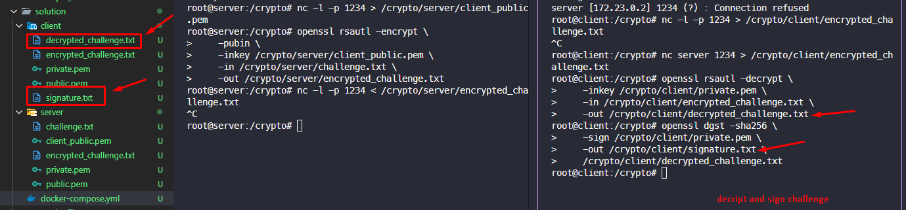


**Server Side:**
```bash
# Receive client's signature
echo "Waiting for client's signature..."
nc -l -p 1234 > /crypto/server/received_signature.txt

# Verify signature using client's public key
echo "Verifying signature..."
openssl dgst -sha256 \
    -verify /crypto/server/client_public.pem \
    -signature /crypto/server/received_signature.txt \
    /crypto/server/challenge.txt
```
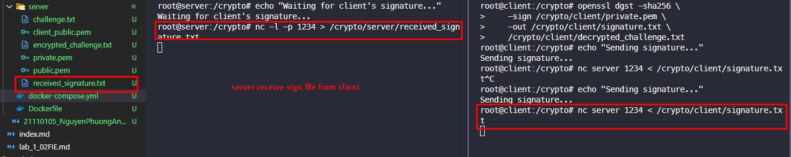

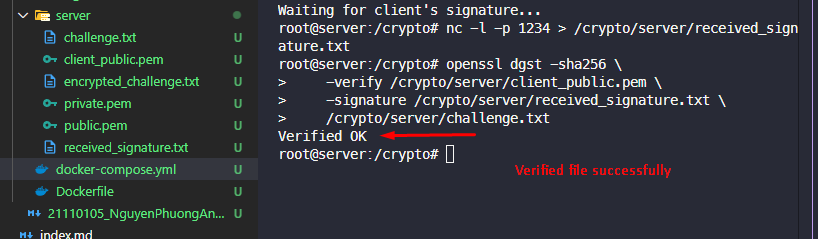

**Explanation:**
- Client signs decrypted challenge with private key
- Signature is sent to server
- Server verifies signature using client's public key
- Successful verification proves client's identity

## 6. Security Analysis

1. **Key Security:**
   - Private keys never leave their respective systems
   - Only public keys are exchanged

2. **Challenge Properties:**
   - Unique per session (includes timestamp)
   - Encrypted with client's public key
   - Only legitimate client can decrypt

3. **Authentication Strength:**
   - Two-way verification process
   - Proves possession of private key
   - Resistant to replay attacks (unique challenge)

4. **Communication Security:**
   - All sensitive data is encrypted
   - Digital signatures ensure authenticity
   - Challenge-response prevents impersonation
 


**Question 2**:
Modify the 8th byte of encrypted file in both modes (this emulates corrupted ciphertext).
Decrypt corrupted file, watch the result and give your comment on Chaining dependencies and Error propagation criteria.

**Answer 2**:

## 1. Create a 256-bit key and a 128-bit IV

**Client Side:**
```bash
# Create working directory and test file
mkdir -p /crypto/client/task2
cd /crypto/client/task2

echo "This is a test message that is longer than 56 bytes for encryption testing purposes. Security is important! Testing error propagation." > input.txt

# Generate a 256-bit key and a 128-bit IV
openssl rand -hex 32 > key.txt
openssl rand -hex 16 > iv.txt
```

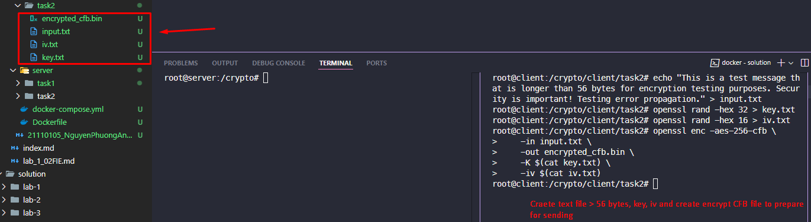

**Explanation:**
- Create a working directory and test file
- Generate a 256-bit key and a 128-bit IV

## 2. Encrypt CFB mode

**Client Side:**
```bash
openssl enc -aes-256-cfb \
    -in input.txt \
    -out encrypted_cfb.bin \
    -K $(cat key.txt) \
    -iv $(cat iv.txt)

nc server 1234 < encrypted_cfb.bin
```
**Server Side:**
```bash
nc -l -p 1234 > encrypted_cfb.bin
```
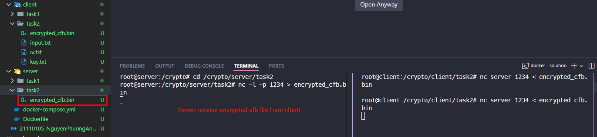

**Explanation:**
- Client encrypts the file using CFB mode
- Encrypted file is sent to server using netcat

## 3. Encrypt OFB mode

**Client Side:**
```bash
# Encrypt OFB
openssl enc -aes-256-ofb \
    -in input.txt \
    -out encrypted_ofb.bin \
    -K $(cat key.txt) \
    -iv $(cat iv.txt)

# Send OFB encrypted file to server
nc server 1234 < encrypted_ofb.bin
```

**Server Side:**
```bash
nc -l -p 1234 > encrypted_ofb.bin
```
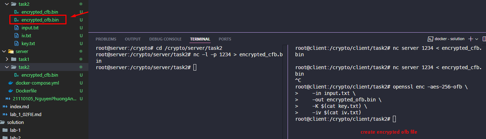
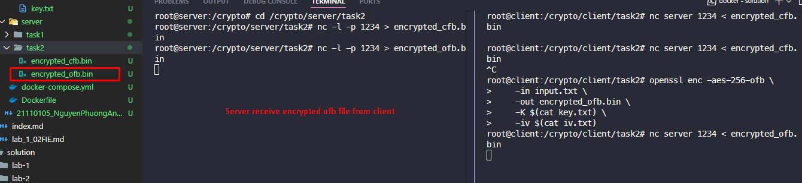

**Explanation:**
- Client encrypts the file using OFB mode
- Encrypted file is sent to server using netcat

## 4. Send key and IV to server

**Client Side:**
```bash
nc server 1234 < key.txt
nc server 1234 < iv.txt
```

**Server Side:**
```bash
nc -l -p 1234 > key.txt
nc -l -p 1234 > iv.txt
```
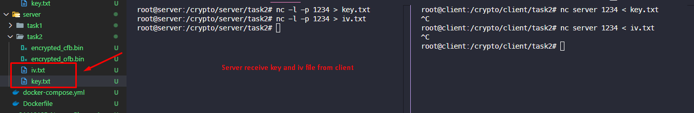

## 5. Create corrupted ciphertext and edit byte 8

Create corrupted ciphertext

**Server Side:**
```bash
# Create a copy of encrypted files
cp encrypted_cfb.bin corrupted_cfb.bin
cp encrypted_ofb.bin corrupted_ofb.bin
```
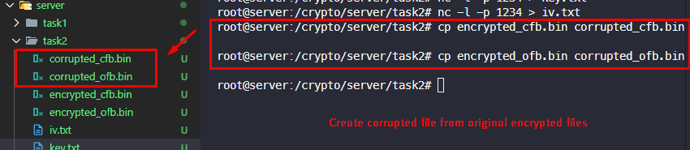

Edit byte 8

**Server Side:**
```bash
printf '\x00' | dd of=corrupted_cfb.bin bs=1 seek=7 count=1 conv=notrunc
printf '\x00' | dd of=corrupted_ofb.bin bs=1 seek=7 count=1 conv=notrunc
```
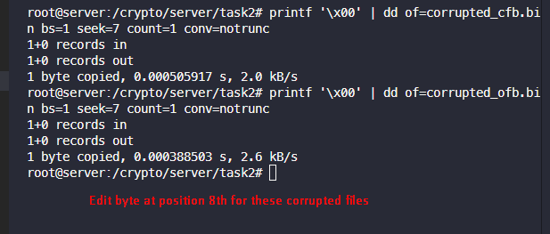

## 6. Decrypt corrupted ciphertext

**Server Side: CFB mode**
```bash
# Decrypt original CFB file
openssl enc -aes-256-cfb -d \
    -in encrypted_cfb.bin \
    -out decrypted_cfb_original.txt \
    -K $(cat key.txt) \
    -iv $(cat iv.txt)

# Decrypt corrupted CFB file
openssl enc -aes-256-cfb -d \
    -in corrupted_cfb.bin \
    -out decrypted_cfb_corrupted.txt \
    -K $(cat key.txt) \
    -iv $(cat iv.txt)
```
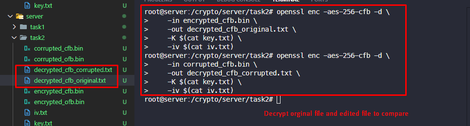

**Output:**
```bash
echo "Original CFB:"
cat decrypted_cfb_original.txt
echo -e "\nCorrupted CFB:"
cat decrypted_cfb_corrupted.txt
```
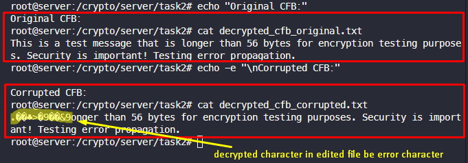

**Explanation:**
- Server decrypts both the original and corrupted ciphertexts
- The original file is successfully decrypted 
- For the corrupted CFB ciphertext:
  - The error at byte 8 affects the entire current block
  - The error propagates to the next block
  - Subsequent blocks are decrypted normally

**Server Side: OFB mode**
```bash
# Decrypt original OFB file
openssl enc -aes-256-ofb -d \
    -in encrypted_ofb.bin \
    -out decrypted_ofb_original.txt \
    -K $(cat key.txt) \
    -iv $(cat iv.txt)

# Decrypt corrupted OFB file
openssl enc -aes-256-ofb -d \
    -in corrupted_ofb.bin \
    -out decrypted_ofb_corrupted.txt \
    -K $(cat key.txt) \
    -iv $(cat iv.txt)
```
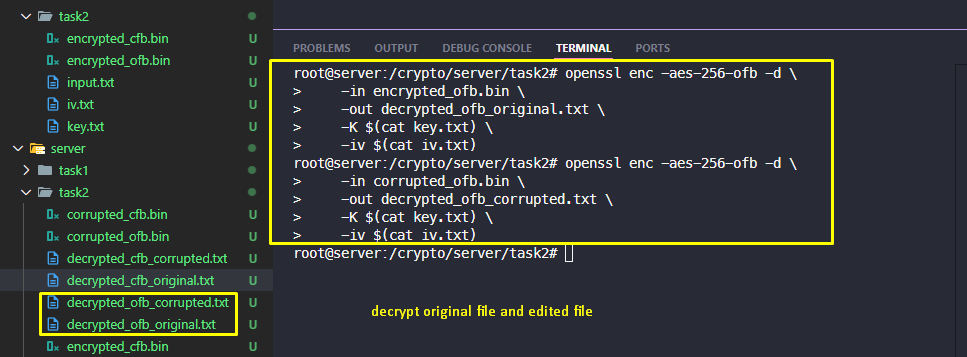

**Output:**
```bash
echo "Original OFB:"
cat decrypted_ofb_original.txt
echo -e "\nCorrupted OFB:"
cat decrypted_ofb_corrupted.txt
```
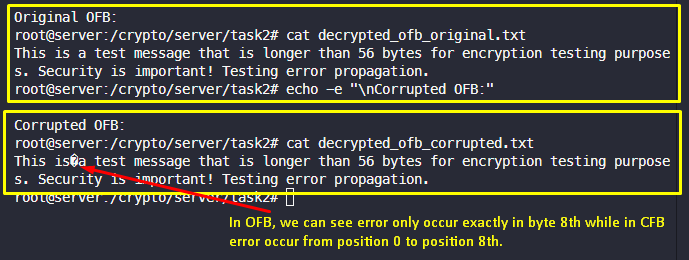

**Explanation:**
- For the corrupted OFB ciphertext:
  - The error at byte 8 affects the entire current block
  - The error propagates to the next block
  - Subsequent blocks are decrypted normally

## 6. Security Analysis

- Chaining dependencies:
  - The error in the corrupted ciphertext affects the entire current block
  - The error propagates to the next block
  - Subsequent blocks are decrypted normally

- Error propagation criteria:
  - The error at byte 8 affects the entire current block
  - The error propagates to the next block
  - Subsequent blocks are decrypted normally


